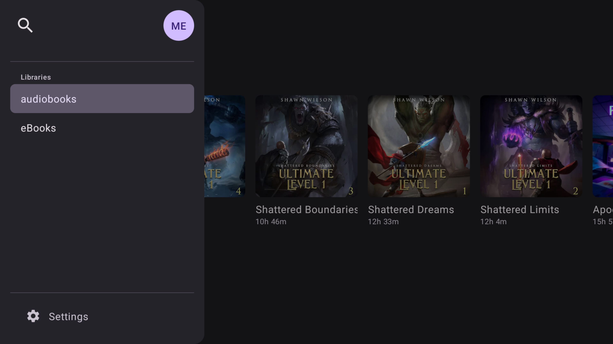
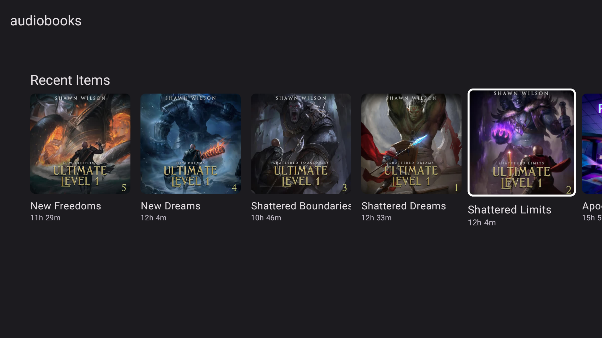
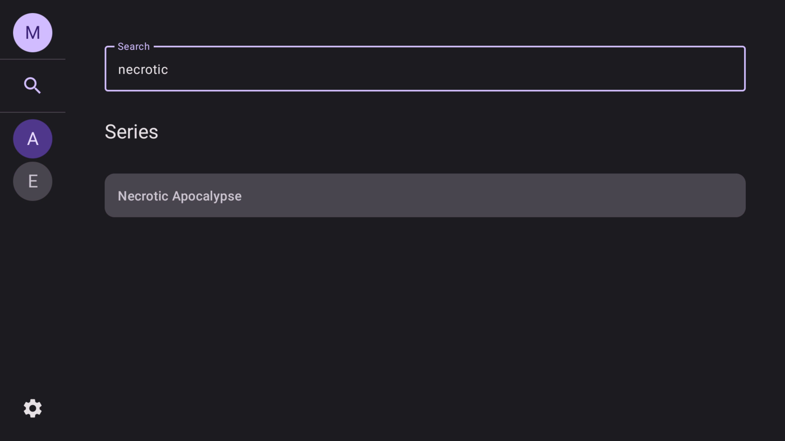
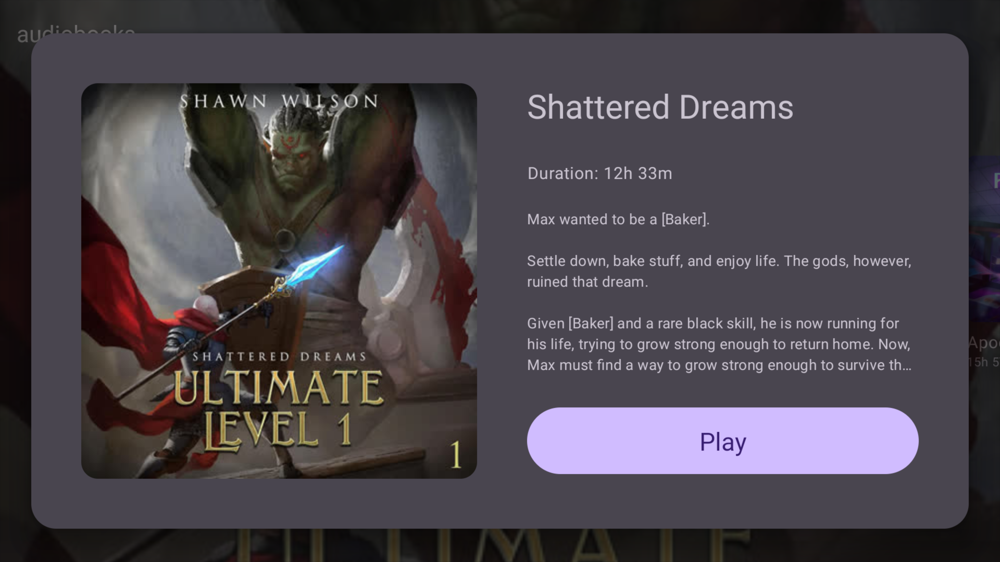
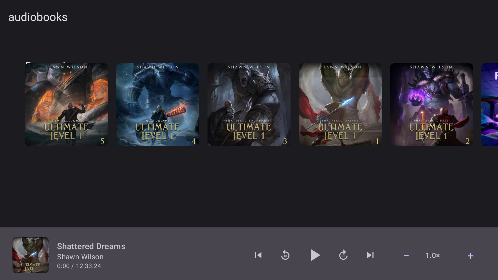
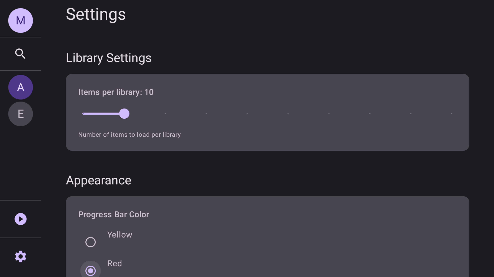

# SwiftShelf for Android TV

<p align="center">
  
</p>

A native Android TV client for [Audiobookshelf](https://www.audiobookshelf.org/), offering a sleek, remote-friendly interface for browsing and playing your audiobooks.


## Features

### Authenticated Connection & Secure Storage
- Logs in with Audiobookshelf host and API key
- Credentials securely stored using Android's EncryptedSharedPreferences
- Seamless reconnection after app relaunch



### Library Selection & Persistence
- Choose from available Audiobookshelf libraries
- Select multiple libraries to browse at once
- Remembers your selected libraries

### Recent & Continue Listening Carousels
- Browse recently added audiobooks
- Pick up where you left off with in-progress items
- Cover artwork with author, duration, and playback progress
- Smooth horizontal scrolling carousels



### Search
- Query your library with natural search
- Results display books with cover art and metadata
- Quick access to search functionality



### Detailed Item Popup & Quick Play
- Material Design sheet with book details
- Author, narrator, series information
- Duration and progress tracking
- Prominent play button to start playback



### Compact Mini Player
- Bottom player banner with playback controls
- Cover artwork and elapsed time display
- Playback speed adjustments (0.5x - 3.0x)
- Play/pause without leaving browse UI
- Thin progress bar across the screen bottom



### Customizable Experience
- Adjust library item fetch count (default: 10)
- Choose carousel progress-bar color
- Set default playback speed
- Persistent settings across sessions



### Authenticated Cover Fetching
- Securely fetch cover images with authentication
- Cached for smooth browsing performance
- High-quality artwork display

### Android TV Optimized
- Remote-friendly navigation
- D-pad and touch support
- Focus-aware UI elements
- Material Design 3 components
- Landscape-optimized layouts

## Technical Features

- **Progress Sync**: Automatically syncs playback progress to Audiobookshelf every 5 seconds
- **MediaSession Integration**: System-level playback controls and notifications
- **ExoPlayer**: High-quality audio playback with chapter support
- **Jetpack Compose**: Modern, declarative UI framework
- **Material Design 3**: Latest Android design guidelines

## Requirements

- Android TV device or Android device running Android 8.0 (API 26) or higher
- Audiobookshelf server instance with API access
- Network connection to your Audiobookshelf server

## Installation

### From Release
1. Download the latest APK from the [Releases](https://github.com/michaeldvinci/swiftshelf-android/releases) page
2. Install via ADB: `adb install app-debug.apk`
3. Or sideload using your preferred method

### Building from Source
1. Clone the repository
2. Open in Android Studio
3. Ensure you have JDK 17 installed
4. Build and run on your Android TV device or emulator

```bash
./gradlew assembleDebug
adb install app/build/outputs/apk/debug/app-debug.apk
```

## Configuration

### First Launch
1. Launch SwiftShelf on your Android TV
2. Enter your Audiobookshelf host URL (e.g., `https://abs.example.com`)
3. Enter your API key (found in Audiobookshelf settings)
4. Select one or more libraries to browse

### Debug Configuration (Development)
For testing during development, you can create a config file:

```json
// .swiftshelf-config.json
{
  "host": "https://your-abs-server.com",
  "apiKey": "your-api-key-here"
}
```

## Architecture

- **MVVM Pattern**: Clean separation of concerns
- **Repository Pattern**: Data layer abstraction
- **Kotlin Coroutines**: Asynchronous operations
- **StateFlow**: Reactive state management
- **Retrofit**: Network communication
- **Room** (planned): Local caching
- **Coil**: Image loading and caching

## Development

### Project Structure
```
app/src/main/java/com/swiftshelf/
├── MainActivity.kt              # Main entry point
├── SwiftShelfViewModel.kt       # App state management
├── audio/
│   ├── GlobalAudioManager.kt   # Audio playback management
│   └── MediaSessionManager.kt   # System media controls
├── data/
│   ├── model/                  # Data models
│   ├── network/                # API client
│   └── repository/             # Data repositories
├── ui/
│   ├── screens/                # Composable screens
│   └── theme/                  # App theming
└── util/
    └── SecurePreferences.kt    # Encrypted storage
```

### Building
- Minimum SDK: 26 (Android 8.0)
- Target SDK: 34 (Android 14)
- Kotlin: 1.9.20
- Gradle: 8.11.1
- Android Gradle Plugin: 8.10.1

## Roadmap

- [ ] Offline playback support
- [ ] Sleep timer
- [ ] Playback queue management
- [ ] Multiple playback profiles
- [ ] Widget support
- [ ] Android Auto integration
- [ ] Cast support

## Contributing

Contributions are welcome! Please feel free to submit a Pull Request.

## License

[License information to be added]

## Acknowledgments

- [Audiobookshelf](https://www.audiobookshelf.org/) - The amazing audiobook server
- The Android and Jetpack Compose communities

## Support

For issues and feature requests, please use the [GitHub Issues](https://github.com/michaeldvinci/swiftshelf-android/issues) page.
